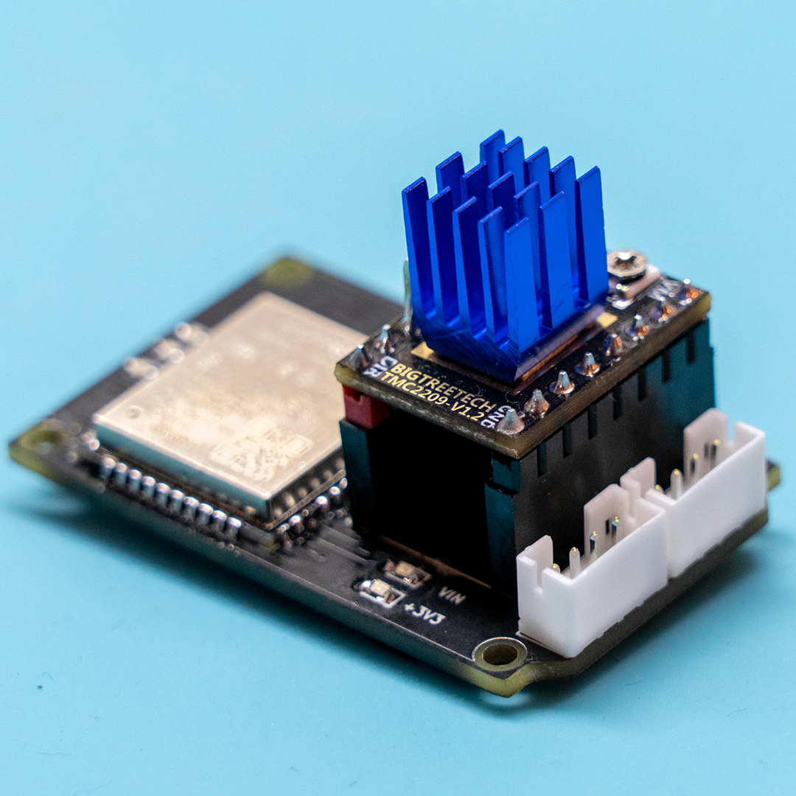
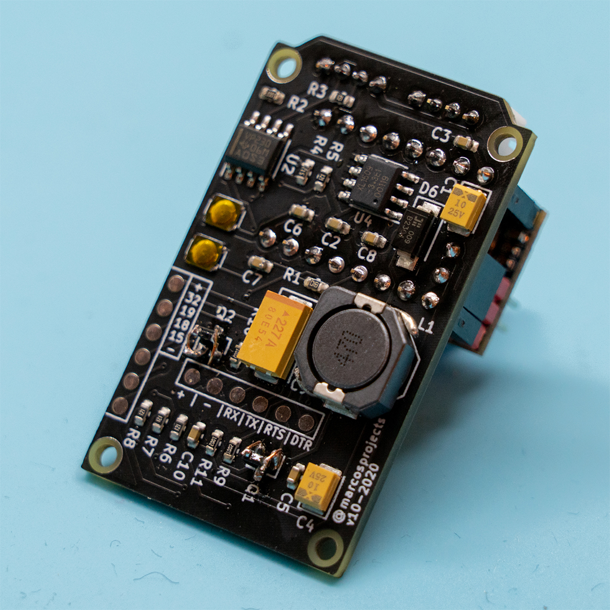

# UniPaste - CAN-bus enabled steppermotor controller
 
 If you would like to support the project, some caffeine is much appreciated :)
 
 
 
 ## Hardware capabilites
 
 
 

 
 UniPaste is essentially a one axis universal steppermotor controller, relying on a Trinamic TMC2209 based stepper driver.
 
 The hardware is based around an ESP32-WROOM microcontroller module, giving UniPaste a blazing fast 2-core 240MHz brain with integrated Wifi and Bluetooth-LE capabilities.
 Additionally, UniPaste has an SN65HVD230 CAN-transceiver IC onboard, which allows for a fast and reliable way of communication with the controller.
 
 The steppermotor and microcontroller are supplied by a single supply voltage ranging between 9V and 24V, which will be suitable for most applications.
 
 The ESP32 microcontroller is flashed with new software using the easily accessible serial interface with hardware flow-control capabilites and auto-reset/auto-program circuitry.
 
 
 ## Software capabilities
 
 A UniPaste board comes pre-flashed with the latest version of the UniPaste firmware, which allows to get started immediately.
 
 Support for WiFiManager and ArduinoOTA makes connecting UniPaste to your local WiFi network super easy and ArduinoOTA in turn enables updating the firmware without even needing to use the hardware serial interface.
 
 Since the software is still in heavy development at this time, here's a usually up-to-date ToDo list:
 
 - [x] ESP_WiFiManager
 - [x] ArduinoOTA
 - [ ] TMC2209 UART control
 - [ ] CAN-bus communication
 - [ ] Basic GCode interpreter
 - [ ] UniPaste setup/configuration via WiFi
 - [ ] WiFi/BT-based wireless control
 
 
 ## Library dependencies
 
* ESP_WiFiManager by [khoih-prog on GitHub](https://github.com/khoih-prog/ESP_WiFiManager)
* LittleFS by [lorol on GitHub](https://github.com/lorol/LITTLEFS)
* ArduinoOTA
* TMCStepper by [teemuatlut on GitHub](https://github.com/teemuatlut/TMCStepper)
* AccelStepper by [Mike McCauley](https://www.airspayce.com/mikem/arduino/AccelStepper/)